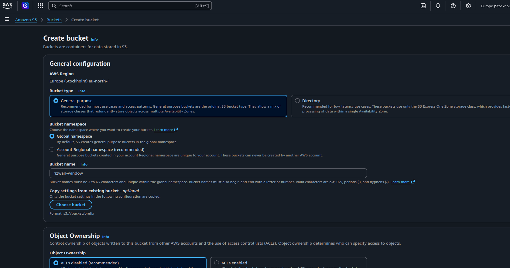
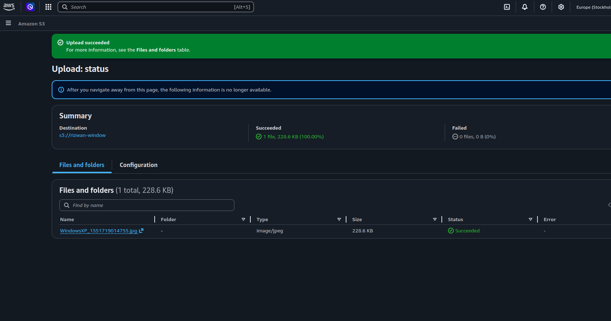

Amazon S3 (Simple Storage Service) is a cloud storage service provided by AWS that allows you to store and retrieve any amount of data from anywhere over the internet. It stores data as objects inside containers called buckets, making it simple to manage files like images, videos, backups, and logs. S3 is designed to be highly durable, secure, and scalable, so you don’t have to worry about storage limits or hardware management. It is widely used for storing application data, hosting static websites, backups, and data analysis.

## Features of S3

- **Scalable storage**  
    Store unlimited amount of data
- **High durability**  
    Designed for 99.999999999% (11 9’s) data durability
- **High availability**  
    Data is always accessible when needed
- **Object storage**  
    Stores data as objects (files) inside buckets
- **Access control**  
    Use IAM policies and bucket policies to control access
- **Versioning**  
    Keep multiple versions of files
- **Lifecycle management**  
    Automatically move or delete old data
- **Security features**  
    Encryption (at rest and in transit)
- **Static website hosting**  
    Can host HTML, CSS, JS websites
- **Integration with AWS services**  
    Works with Lambda, EC2, CloudFront, etc.
### Different between S3 and EBS

|Feature|EBS|S3|
|---|---|---|
|Type|Block storage|Object storage|
|Usage|Attached to EC2 (like disk)|Store files (like cloud storage)|
|Access|Only via EC2|Access via internet/API|
|Performance|High (low latency)|Moderate|
|Storage type|Fixed size volume|Unlimited storage|
|Example|OS, database|Images, backups, logs|

## Create Bucket 
Add unique name for the bucket

### Object Ownership 

**Object Ownership** in S3 defines **who owns the files (objects) inside a bucket and who has control over them**.

### ACL 

**ACL (Access Control List)** is a basic permission system in S3 that decides **who can access a bucket or object and what they can do**.

### What is Block Public Access

**Block Public Access** is a security feature in S3 that **prevents your bucket or files from becoming publicly accessible on the internet**, even if someone accidentally adds public permissions. 

### What is Bucket Versioning 

**Bucket Versioning** is a feature in S3 that **keeps multiple versions of the same file** instead of replacing it.

### What is Default Encryption

**Default encryption** in S3 means that **all files uploaded to a bucket are automatically encrypted** without you needing to do anything manually. this settings for who have the key for encryption.

### Upload the image 

